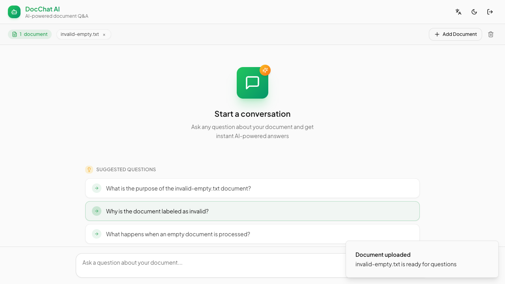
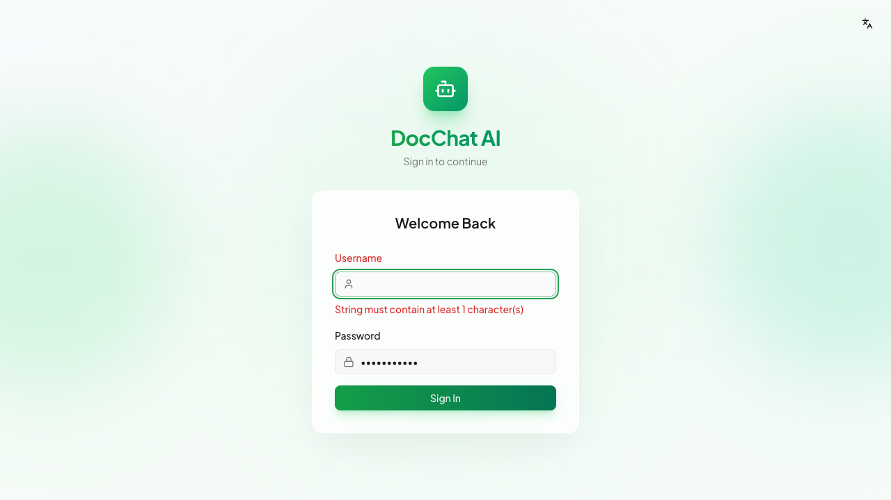
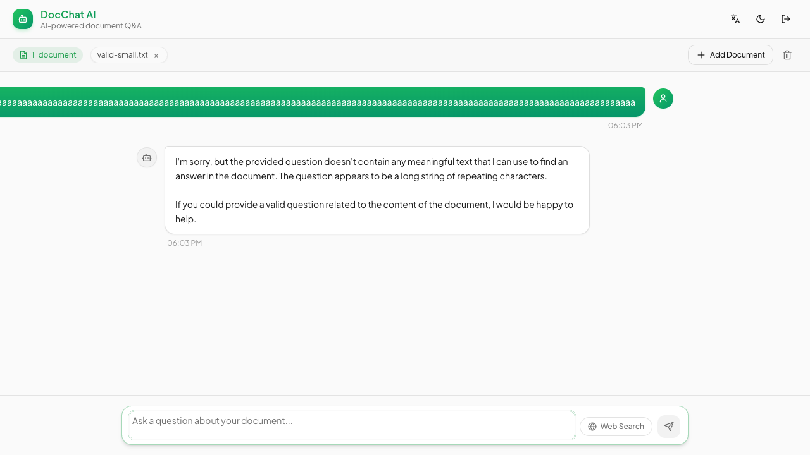
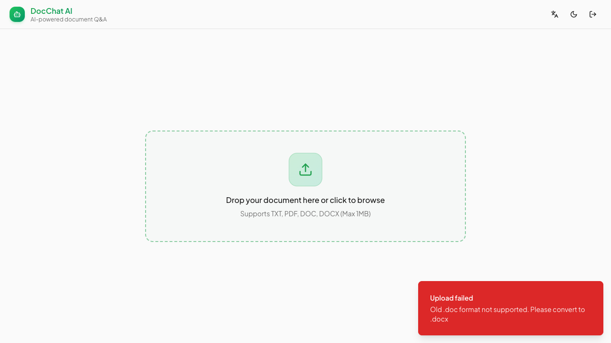

# DocChat AI — Bug Report

App: https://sdet-chatbot.onrender.com  

---

## Summary

| ID | Area | Title | Severity | Priority |
|---|---|---|---|---|
| [BUG-001](#bug-001) | File Upload | Empty .txt file accepted without error | Medium | P2 |
| [BUG-002](#bug-002) | Login | Raw Zod validation error exposed to user | Medium | P2 |
| [BUG-003](#bug-003) | Chat | Long unbroken text overflows chat bubble | Medium | P3 |
| [BUG-004](#bug-004) | File Upload | UI advertises .doc support but server rejects it | Medium | P2 |

---

## Details

### BUG-001
**Empty .txt file accepted without error**  
**Severity:** Medium  
**Area:** File Upload  
**Test file:** `data/documents/invalid-empty.txt`

**Steps to reproduce:**
1. Log in and reach the upload screen
2. Upload `invalid-empty.txt` (0 bytes)

**Actual:** File accepted — toast shows *"Document uploaded — invalid-empty.txt is ready for questions"* and the chat interface opens  
**Expected:** Upload rejected with an error such as *"File is empty"*

---

### BUG-002
**Raw Zod validation error exposed to user on login**  
**Severity:** Medium  
**Area:** Login

**Steps to reproduce:**
1. Go to the login page
2. Leave Username empty, enter any password
3. Click Sign In

**Actual:** *"String must contain at least 1 character(s)"*  
**Expected:** *"Username is required"*

---

### BUG-003
**Long unbroken text overflows chat bubble**  
**Severity:** Medium  
**Area:** Chat

**Steps to reproduce:**
1. Log in and upload any document
2. Type 600+ characters without spaces into the chat input
3. Submit

**Actual:** User message bubble overflows past both viewport edges — text is unreadable  
**Expected:** Text wraps within the bubble (`word-break: break-all` or `overflow-wrap: break-word`)

---

### BUG-004
**UI advertises .doc support but server explicitly rejects it**  
**Severity:** Medium  
**Area:** File Upload

**Steps to reproduce:**
1. Log in and observe the upload zone hint: *"Supports TXT, PDF, DOC, DOCX (Max 1MB)"*
2. Upload any `.doc` file

**Actual:** Server responds with *"Upload failed — Old .doc format not supported. Please convert to .docx"* — contradicting the format hint  
**Expected:** Either .doc is supported, or "DOC" is removed from the hint

**Note:** `.doc` is still allowed in `<input accept=".txt,.pdf,.doc,.docx">`, so the file is selectable in the picker, making the rejection unexpected.
